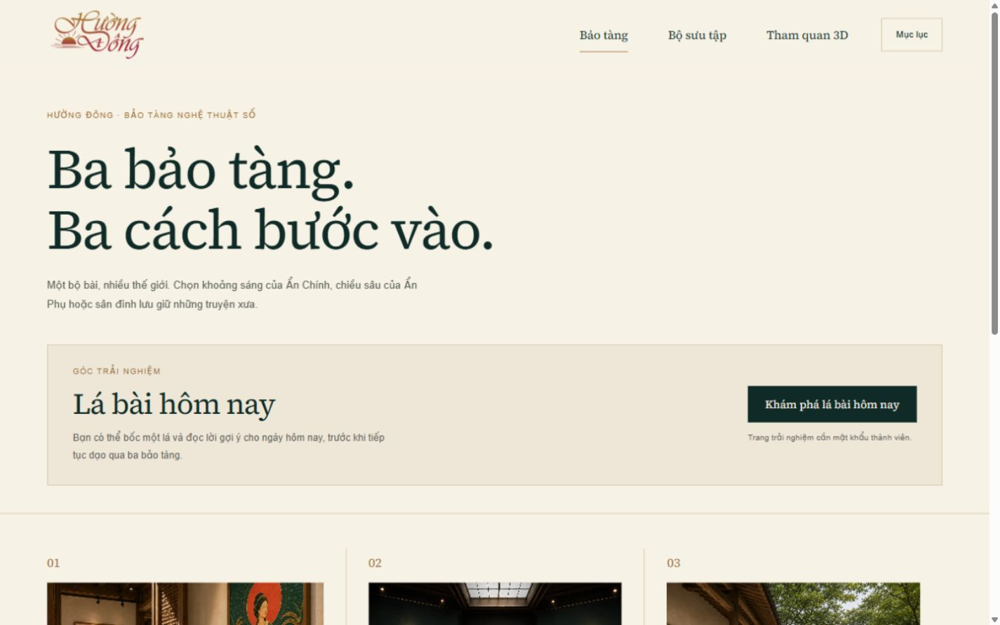
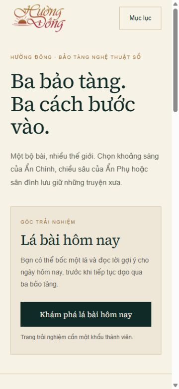

# QA · CTA Lá bài hôm nay trong Bảo tàng 78 lá

Ngày kiểm tra: 10/09/2026. Nhánh: `feat/museum-daily-card-cta-20260910`.
Bản dựng dùng seed tại `http://localhost:8131/la-bai/`, không phải production.

## Nội dung đã xác nhận

- Khối CTA công khai nằm sau lời giới thiệu đại sảnh, trước ba phòng.
- Nút “Khám phá lá bài hôm nay” dẫn tới `/thanh-vien/la-bai-hom-nay/`.
- Lời nhắc mật khẩu hiện dưới nút, không hiển thị hoặc truyền mật khẩu trong URL.
- Nút là liên kết HTML thông thường, không cần staff hoặc JavaScript để xuất hiện.
- Trang đích giữ nguyên cổng mật khẩu và `noindex,nofollow`; nội dung bốc bài
  vẫn ẩn khi chưa mở cổng. Không thử đổi mật khẩu hay dữ liệu lưu của người dùng.
- Nút hoạt động bằng chuột và Enter; liên kết trong lời dẫn trang đích đưa về
  đại sảnh qua vòng đời Swup. Không ghi nhận cảnh báo/lỗi console.

## Responsive

Đo `scrollWidth`, kích thước nút và grid sau khi xác nhận viewport đã đổi:

- 375×812, 430×932, 620×900, 621×900, 744×1133, 768×1024, 900×900.
- 901×900, 932×430, 1024×768, 1100×900, 1101×900, 1440×900.

Tất cả 13 khổ không tràn ngang; nút cao 52px và nằm trong bề ngang màn hình.
Khối CTA một cột tới 900px, hai cột từ 901px; nút rộng toàn cột tới 620px.
Đã xem ảnh ở desktop 1440×900 và điện thoại 375×812. Đây là mô phỏng viewport
trình duyệt, chưa phải kiểm tra trực tiếp trên thiết bị iOS/Android thật.

## Kiểm tra tự động

- `npm run build:local`: 78 trang lá, 38 bài tin, 176 URL.
- `npm test`: 188/188 đạt.
- `npm run check:types`: đạt.
- `git diff --check`: đạt.

Giữ nguyên ba bảo tàng, phòng 3D và ghi chú mobile. Không thay thuật toán/lời
đọc, mật khẩu, Firestore, cấu hình Firebase hoặc workflow xuất bản.
