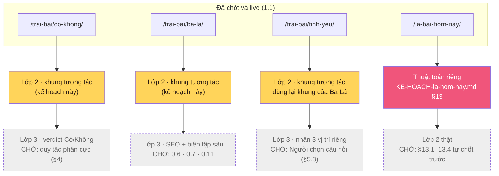

# Kế hoạch — Khung cho ba trang trải bài theo nhu cầu (1.2 · 1.3 · 1.4)

Lập 24/08/2026. Đọc cùng `tools/ROADMAP.md`, `tools/PHAN-CONG.md` và
`tools/KE-HOACH-la-hom-nay.md`. Đây **chỉ là hướng dẫn** — không có code nào bị
đụng khi viết tài liệu này.

**Phạm vi:** `/trai-bai/co-khong/`, `/trai-bai/ba-la/`, `/trai-bai/tinh-yeu/`.
**Không nằm trong phạm vi:** `/la-bai-hom-nay/` — nó có kế hoạch riêng
(`KE-HOACH-la-hom-nay.md`) với bốn câu hỏi riêng ở §13, không liên quan tới
0.6/0.7/0.11. Gộp chung sẽ làm rối cả hai.

---

## 0 · Đã kiểm gì trước khi viết

| Kiểm | Cách kiểm | Kết quả |
|---|---|---|
| 1.1 đã làm tới đâu | `git log`, `git diff main`, `npm test` trên nhánh `feat/1.1-intent-url-structure` | **Đã có** — 4 URL chốt, trang tạm "Đang phát triển thêm", `noindex,follow`, breadcrumb, canonical. 36/36 test đạt. Đã push lên origin, **chưa merge vào main**. |
| Bộ rút bài đã có sẵn gì | Đọc `public/assets/js/trai-bai.js`, `deck-data.js`, mục "Rút bài" trong `templates/trai-bai.html` | **Đã chạy được**: xáo Fisher-Yates, lật 3D, đọc ngược, chọn cỡ trải qua `<select data-spread>` với `value="1"` và `value="3"` **có sẵn** |
| Bộ dữ liệu rút bài phủ được gì | Đọc `deck-data.js` | Chỉ **22 Ẩn Chính**, chưa có Ẩn Phụ. Trang tự ghi chú: *"Mặt lưng đang là bản tạm — sẽ thay bằng art trống đồng thật ở đợt cập nhật hình ảnh"* |
| Có trường "phân cực Có/Không" trên lá không | `grep` toàn bộ `seed/cards.json` | **Không có.** Không phải lỗ hổng cần vá gấp — là quyết định nội dung chưa ai đưa ra |
| 0.6 — báo cáo 54 chỗ có thật không | Đọc `tools/content/rename-report.json` | **Đây là fixture kiểm thử** (`"dir": "_test/regress"`, 4 file, 4 mục "unanchored", 2 "anchored") — đúng 5 ví dụ bug trong `Hiệu ứng và source code đề xuất`. **Không phải báo cáo 54 mục thật.** Báo cáo thật cần chạy lại `npm run scan:legacy` nhắm vào repo/site đang chạy |
| 0.7 — 23 xung đột có thật không | Đọc `tools/content/folk-conflicts.md` | **Có thật**, đúng 23 mục, mỗi mục ba lựa chọn: giữ v2.1 / giữ neo cũ / bỏ trống. Sẵn sàng để đọc bất cứ lúc nào |
| 0.11 — bản chất câu hỏi | `grep "S09"` trong `tools/content/sources.mjs`, `major-arcana.json` | `S09` = *"Truyện Chim trĩ trắng"*. Lá XXI hiện dẫn `sourceId: "S12"`. Tên hai nguồn trùng chủ đề (bạch trĩ) — đây là gốc của câu hỏi *"v2.1 sót S09?"*, chưa tự suy ra câu trả lời |

**Kết luận:** ba trong bốn thứ bạn liệt kê đúng là chưa xong. Ngoài ra, còn phát hiện thêm
một khoảng trống nhỏ không nằm trong bốn mục đó: **chưa có quy tắc "lá nào → Có/Không"**
cho trang `co-khong`. Xem §4.

---

## 1 · Vì sao vẫn tách được một lớp an toàn để làm ngay

Không phải mọi phần của 1.2–1.4 đều chờ 0.6/0.7/0.11. Có **ba lớp**, và chỉ lớp
ngoài cùng mới đụng dữ liệu đang tranh cãi:

```
Lớp 1 · URL + khung trang         không cần dữ liệu lá nào        ĐÃ XONG (1.1)
Lớp 2 · Cơ chế rút + hiện kết quả  chỉ cần TÊN + TÓM TẮT lá         AN TOÀN NGAY — đây là kế hoạch này
Lớp 3 · Nội dung biên tập sâu      cần tên đã chốt, nguồn đã chốt   CHỜ 0.6 · 0.7 · 0.11
```

**Vì sao Lớp 2 an toàn dù 0.6/0.7/0.11 chưa xong:** `deck-data.js` đọc thẳng từ
`content/major-arcana.mjs` — nguồn chuẩn v2.1 **đã chốt cho 22 Ẩn Chính** từ Đợt 0
(xem `ROADMAP.md`: *"Đổi tên 16 Ẩn Chính — PR #1"*, đã seed lên Firestore, đã live).
0.6/0.7/0.11 là các mục **còn treo lại sau** vòng đó — tên chương LNCQ ở các trang
phụ, 23 lá Ẩn Phụ, và một câu hỏi dẫn nguồn của riêng lá XXI. Lớp 2 chỉ cần tên +
tóm tắt của 22 Ẩn Chính, dữ liệu đó đã ổn định và **không nằm trong phạm vi ba mục
đang chờ**.

Nói cách khác: khung tương tác (rút bài, lật lá, hiện kết quả) không "đoán trước"
0.6/0.7/0.11 — nó chỉ dùng lại đúng thứ đã chốt xong, và **chừa chỗ trống có nhãn**
cho phần chưa chốt. Đó là ranh giới mà spec dưới đây phải giữ.

---

## 2 · Sơ đồ — bốn trang, ba trạng thái



Vàng = làm được ngay, không chờ ai. Hồng = việc khác, đã có kế hoạch riêng, đang
tự chờ bốn câu hỏi thiên văn của chính nó. Nét đứt xám = chưa đụng tới, đúng ý
*"bỏ qua các phần hình ảnh, ghi đang phát triển"* — ở đây mở rộng thành *bỏ qua mọi
phần cần quyết định nội dung, giữ nhãn "Đang phát triển thêm"* — cùng một mẫu chữ
`v2-pending` đã dùng ở trang tạm hiện tại.

---

## 3 · Khung chung cho cả ba trang

Cả ba dùng lại đúng một cơ chế nền — `#hd-deck` + `deck-data.js` + `trai-bai.js` —
thay vì viết mới. Khác nhau ở **cỡ trải cố định** và **nhãn vị trí**:

| Trang | Cỡ trải | Vị trí | Có sẵn trong `<select data-spread>` |
|---|---|---|---|
| Có hoặc Không | 1 | (không có nhãn — một lá, một câu trả lời) | `value="1"` ✅ |
| Ba Lá | 3 | Quá khứ · Hiện tại · Hướng đi | `value="3"` ✅ |
| Tình Yêu | 3 | *(cần Người đặt tên riêng, xem §5.3)* | `value="3"` ✅ |

**`trai-bai.js` không nằm trong danh sách cấm sửa** của dự án (khác với
`light-journey.js`, `site.js`, `motion-gate.js`, `scripts/lib/render.js`) — nó
**được phép mở rộng**. Việc cần thêm: cỡ trải **cố định** (bỏ dropdown), và
**nhãn vị trí** gắn vào từng lá khi hiện kết quả — hai thứ `deal()` hiện tại chưa
làm (xem trích mã ở prompt, §3.4).

### Trạng thái giao diện — giống nhau cho cả ba trang

```
[Chưa rút]  →  bấm "Xáo và rút"  →  [Đang rút] (hoạt ảnh lật, đã có sẵn)
                                          ↓
                                    [Đã rút] — hiện đủ số lá, mỗi lá kèm:
                                      · tên lá (đã chốt, từ deck-data.js)
                                      · tóm tắt LNCQ (đã chốt)
                                      · liên kết "Xem lá đầy đủ →" (đã có)
                                      · [CHỈ co-khong] khối verdict — nhãn
                                        "Đang phát triển thêm" thay vì Có/Không thật
```

Không trang nào cần ảnh mới: mặt lưng lá dùng đúng bản tạm đang chạy, nguyên văn
ghi chú đã có sẵn trong `trai-bai.html`: *"Mặt lưng đang là bản tạm — sẽ thay bằng
art trống đồng thật ở đợt cập nhật hình ảnh."* Không sửa câu đó, không thêm ảnh nào.

---

## 4 · Khoảng trống mới phát hiện — "Có/Không" tính từ đâu

`co-khong` cần một quy tắc: lá nào, xuôi hay ngược, thì nghiêng Có hay Không.
Quy tắc đó **không tồn tại** trong dữ liệu hiện có, và **không nằm trong 0.6/0.7/0.11**
— đây là một quyết định biên tập riêng, y hệt tinh thần câu hỏi §13 của
`KE-HOACH-la-hom-nay.md` (mỗi thuật toán mới có bộ câu hỏi riêng của nó).

**Khung của kế hoạch này cố ý không tự chế ra quy tắc đó.** Hai lý do:

1. Suy luận "lá xuôi = Có, lá ngược = Không" nghe hợp lý nhưng có thể sai với tinh
   thần một vài lá — ví dụ The Tower xuôi vẫn thường đọc là điềm xấu. Đặt sai một
   lần rồi phải sửa ngược lại tốn hơn là để trống và hỏi thẳng.
2. Nếu khung tự đặt quy tắc, khi Người quyết định khác thì phải sửa cả logic lẫn
   nội dung cùng lúc — trong khi khung chỉ nên đợi **một cột dữ liệu mới**, không
   phải viết lại code.

**Cách khung xử lý:** rút lá, hiện tên + tóm tắt như bình thường, nhưng khối
"verdict" (badge Có/Không lớn ở đầu kết quả) hiện nhãn `v2-pending` thay vì tính
thật. Khi Người chốt quy tắc, chỉ cần thêm cột dữ liệu và nối vào đúng một chỗ
trong `trai-bai.js` — khung không đổi.

**Câu hỏi mới, không khẩn:** *"Có/Không tính theo xuôi–ngược của một lá, hay theo
một bảng phân cực soạn riêng cho 78 lá?"* Không chặn khung — chỉ chặn Lớp 3.

---

## 5 · Ba câu đã biết, cộng một câu mới — không câu nào chặn khung

| | Câu hỏi | Thuộc mục | Chặn cái gì |
|---|---|---|---|
| 1 | 54 quyết định đổi/giữ tên | 0.6 | Lớp 3 của Ba Lá/Tình Yêu — **và trước đó, cần chạy lại `scan:legacy` để báo cáo thật tồn tại** |
| 2 | 23 xung đột dân gian | 0.7 | Lớp 3 — nội dung Ẩn Phụ nếu sau này trải bài dùng cả 78 lá |
| 3 | Nguồn lá XXI (S09 vs S12) | 0.11 | Lớp 3 — đúng một dòng dẫn nguồn, không chặn cơ chế |
| 4 · mới | Quy tắc Có/Không | *(chưa có mã số)* | Lớp 3 của riêng `co-khong` — xem §4 |
| 5.3 · mới | Nhãn ba vị trí cho Tình Yêu | *(chưa có mã số)* | Lớp 3 của riêng `tinh-yeu` — ví dụ đề nghị: *"Điều bạn mang vào · Điều đối phương mang vào · Điều cả hai đang tạo ra"*, nhưng đây là gợi ý, không phải quyết định thay |

Không câu nào ở trên **chặn khung Lớp 2**. Khung dùng dữ liệu đã chốt (22 Ẩn Chính),
và để trống có nhãn ở đúng những chỗ còn treo.

---

## 6 · Việc này khớp `PHAN-CONG.md` ở đâu

Bảng phân công hiện ghi 1.2/1.3/1.4 nguyên khối, giao **ChatGPT**, phụ thuộc 1.1.
Kế hoạch này đề nghị **tách một lớp phụ, không đổi số mục**:

```
1.1  (đã có)         URL + trang tạm
1.2 / 1.3 / 1.4      ── Lớp 2: khung tương tác ──→ ChatGPT viết từ prompt này
                     ── Lớp 3: nội dung + verdict + SEO ──→ chờ 0.6 · 0.7 · 0.11 · §4 · §5.3
```

Không cần sửa `PHAN-CONG.md` để làm việc này — Lớp 2 vẫn là "ChatGPT viết những gì
spec nói hết được", đúng nguyên tắc gốc của `ROADMAP.md` §3. Chỉ khi Lớp 3 bắt đầu
mới cần cập nhật bảng phân công với các câu hỏi mới ở §4/§5.3.

---

## 7 · Cổng nghiệm thu của riêng khung này

```bash
node tools/scripts/check-palette.mjs   # không liên quan nội dung này, chạy để chắc chưa hỏng
npm run build:local
npm test
```

- Cả ba trang **vẫn còn** `<meta name="robots" content="noindex,follow">` — khung
  không tự ý gỡ, vì nội dung thật (Lớp 3) chưa xong
- Cả ba trang **vẫn không có trong** `dist/sitemap.xml`
- `co-khong`: rút được 1 lá, hiện tên + tóm tắt, khối verdict hiện nhãn
  `v2-pending`, **không hiện chữ "Có" hay "Không" thật**
- `ba-la`, `tinh-yeu`: rút được 3 lá, mỗi lá có nhãn vị trí, không lá nào thiếu
  nhãn
- Không trang nào tải ảnh mới — `network requests` chỉ gồm ảnh đã có trong
  `public/assets/img/cards/`
- `tests/intent-routes.test.mjs` (đã có, 1.1) vẫn đạt nguyên vẹn — khung này
  **cộng thêm** test, không sửa test cũ

Prompt đầy đủ cho ChatGPT: `tools/PROMPT-ChatGPT-1.2-1.4-khung-trai-bai.md`.
